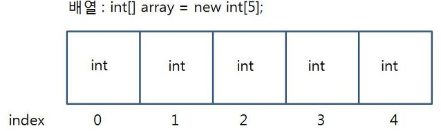
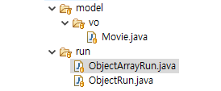
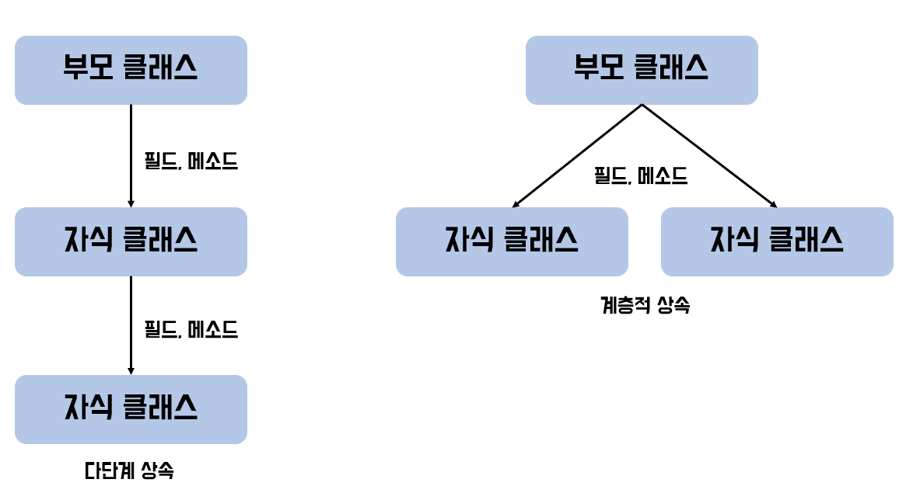

# JAVA_Study
Study JAVA basic elements  
자바를 시작하며 공부한 내용들이다. 배운 내용을 총 14개 프로젝트로 정리하였다.


---
## 01_My_First_Project

### Method : 쉽게 이해하기 위해 기능을 의미한다.  
하나의 클래스에 여러개의 메소드가 존재 가능하다.  
메소드의 이름은 중복이 가능하지만 특정 조건을 만족하여야한다.

메소드는 main 메소드와 일반 메소드로 나눤다.  
메소드는 실행하는 것을 호출한다.   
일반 메소드 같은 경우에는 스스로 실행될 수 없다.  
다른 메소드에서 호출을 해줘야만 실행될 수 있다.  

---
## 02_Variable  

### 형변환: 값의 종류라는 뜻, 캐스트한다라는 것은 자료형을 바꾸는 개념이다

### 컴퓨터에서 값을 처리하는 규칙   
1. = (대입연산자)를 기준으로 양쪽이 같은 자료형이여야 한다.  
자료형이 다를경우 오른쪽 대입할 자료형을 변경시켜야한다.  
2. 같은 자료형끼리만 연산이 가능하다.  
-다른 자료형끼리 연산을 하고자 한다면 둘중 하나는 형변환을 통해 동일한 자료형으로 변환해야한다.  
3. 연산의 결과물도 같은 자료형이여야 한다.  

[표현법](바꿀자료형)값
형변환연산자,cast 연산자

### 형변환의 종류  
1. 자동형변환 : 자동으로 형변환된다. 직접 형변환 해줄 필요 없다.  
작은 크기의 자료형 -> 큰 크기의 자료형  
2. 강제형변환 : 자동으로 형변환이 진행되지 않는 경우.  
직접 형변환을 해야한다->형변환 연산자를 통해 
큰 크기의 자료형 -> 작은 크기의 자료형  
때문에 값의 손상이 있을 수 있다.  

### 구문 출력방법
System.out.printf("출력하고자 하는 형식", 출력하고자하는 값);  
여기서 f는 format(형식)을 의미한다.  
단, 문자열안에 원하는 값이 들어갈 공간을 형식화 하여야한다.  

형식  
* %d : 정수  
* %f : 실수  
* %c : 문자  
* %s : 문자  

```java
System.out.printf("Hello World");
//printf로 출력 - 줄바꿈 기능이 없기 때문에 개행문자 \ n으로 줄 바꿈 해준다.
System.out.println("Hello World");
```

etc)
키보드로 사용자로부터 값을 입력받으려면?  
자바에서 제공하고 있는 java.util.Scanner 라고하는 클래스를 활용하면 된다.  

```java
import java.util.Scanner;
Scanner sc = new Scanner(System.in);
```

---
## 03_Operator

### 산술 연산자: 이항연산자로서 연산방법, 우순위가 일반 수학산과 동일하다.
* 덧셈: +, 뺄셈: -, 곱셈: *, 나눗셈: /, 나머지(Modular): % (나눗셈에서 나머지를 구한다.)  

### 증감연산자: 당항 연산자로서 한 번에 1씩 증가 하거ㅓ나 1씩 감소하는 연산을 말한다.  
* -먼저 증감을 할 것인지 나중에 증감을 할것인지 연산자의 위치에 따라 달라진다.  
* [표현법]  
* ++ : 값을 1씩 증가시키는 연산자  
* -- : 값을 1씩 감소시키는 연산자  

### 연산자의 위치
* 전위연산: ++값, --값 (먼저 1을 증감처리한 후 그 값을 처리한다)
* 후위연산: 값++, 값-- (값을 먼저 처리한 후에 증감을 수행한다)

### 복합대입연산자: 다른 산술 연산자랑 대입연산자가 결합한 것. 이항연산자
* -자기 자신과 해당 산술연산 후에 그 결과를 다시 자신에게 대입하는 연산자. 
* +=  
* -=  
* *=  
* \       /=  
* %=    
예시) a += 3; 은 a = a + 3; 기존에 a라는 값에 +3을 한 뒤에 다시 a에 대입해라.

### 논리 부정 연산자 : 논리값(true/false)를 반대로 바꿔주는 연산자  
[표현법]!논리값
```java
if(!flase){
  System.out.print("Hello World");
}
```

### 비교연산자 (관계연산자)
* 두개의 값을 가지고 비교, 이항 연산자
* 비교연산을 한 결과 -> 참일 경우 ture / 거짓일 경우 false
* 특정 조건을 제시할 수 있는 조건문에서 쓰인

종류  
1. 크고 작음을 비교
* a < b : a가 b보다 작습니까?
* a > b : a가 b보다 큽니까?
* a <= b : a가 b보다 작거나 같습니까?
* a >= b : a가 b보다 크거나 같습니까?
2. 일치함을 비교 - 동등비교
* a == b : a와 b가 같습니까?
* a != b : a와 b가 같지 않습니까?
* 피연산자는 숫자, 결과값은 논리값

### 논리 연산자 : 이항연산자, 두개의 논리값을 연산하는 연산자.
* [표현법] 논리값 논리연산자 논리값 -> 결과값도 논리값  

종류
1. AND 연산자: 논리값 && 논리값 [왼쪽, 오른쪽 둘다 	true여야 결과값도 true]  
2. or 연산자: 논리값 || 논리값 [왼쪽, 오른쪽 둘 중 하나라도 true면 결과값이 true]

### 삼항 연산자 : 피연산자가 3개 -> 값 3개와 연산자 1개로 이루어짐.
조건식 형태로 쓰인다.  

 #조건식 :  결과값에 따라서 연산을 처리하는 방식
* 결과값이 참일 경우 식1을 처리하고.
* 결과값이 거짓일 경우 식2를 처리한다.
[표현법]
조건이 ? 조건이 true일 경우 결과값: 조건이 false일 경우 결과값;
```java
Scanner sc = new Scanner(System.in);
System.out.println("정수 입력 : ");
int num = sc.nextInt();
//중첩삼항연산자를 이용하여.		
String result = (num != 0) ? ((num >0)? "양수입니다." : "음수입니다.") : "0입니다.";
System.out.println("입력 받은 " + num + "은 " + result);
```
  
---
## 04_Control

### 단독 if
[표현법]
```java
if(조건식){
  //수행하고자 하는 구문
}
```
* -조건식의 결과값이 true일 경우: 중괄호 안에 있는 코드를 실행
* -조건식의 결과값이 false일 경우: 중괄호 안에 있는 코드를 건너 뜀

### if-else 문 
[표현법]
```java
if(조건식){
  // 조건식이 만족할때(true) 실행하고자 하는 구문 - 1번 
}else{
  // 조건식이 만족하지 않을때 (false) 실행하고자하는 구문 - 2번 
}
```
* -조건식의 결과가 true일 경우엔 1번 코드만 실행
* -조건식의 결과가 false일 경우엔 2번 코드만 실행

### switch 문
[표현법]
```java
switch(아래에 기술할 값들과 동등비교를 할 대상){
  case 값1 : 실행할 코드; // - 대상자 == 값1이 true일 경우 실행할 코드
  break; - switch // 영역을 벗어난다.
case 값2 : 실행할 코드; // - 대상자 == 값2이 true일 경우 실행할 코드
  break; // - switch 영역을 벗어난다.
   //...
case 값n :실행할 코드; // - 대상자 == 값n이 true일 경우 실행할 코드
  break; // - switch 영역을 벗어난다.

default : 실행할 코드; // -if-else문에서 else와 같은 역할을 수행한다.
  //위에 case들을 모두 만족하지 않으면 실행할 코드를 작성한다.
  //break를 적지 않는다(마지막에 실행되고 switch문을 벗어나기 때문)
  //또한 생략이 가능하다.
}
```
**반복문 안에서 쓰이는 구문**   
1. break; :break문을 만나는 순간 "가장 가까운 반복문"을 벗어난다.
* 해당 break; 문을 포함한 가장 가까운 반복문 한겹만 벗어난다.  
* 주의할 점: switch문 안에 있는 break와는 다른 역할.  
* switch문 안에 있는 break는 해당 switch문을 벗어하는 용도로 사용된다. (반복문에 영향 X)
```java
Scanner sc = new Scanner(System.in);
		
while(true){ //무한반복		
  System.out.println("숫자를 입력해주세요.");
  int num = sc.nextInt();
  if(num >= 0) {
    System.out.println(num);
  }else { //입력 받은 수가 음수라면 -- 무한반복을 벗어날 조건
    System.out.println("프로그램을 종료합니다.");
    break;
  }
}
```
2. continue; 구문을 만나면 뒤에 있는 코드를 실행하지 않고 다시 반복문을 실해하게 된다.  
* 이때 for문의 경우는 증감식으로 이동.  
* while문의 경우는 조건식으로 흐름이 이동된다.  
```java
Random r = new Random();
for(int i = 1; i <= 10; i = i+1) {
  int random = r.nextInt(10) + 1;//1부터 10개까지 
  //홀수인 경우니깐 작수인 경우를 제외시키면 된다.
  if(random % 2 == 0) { //random 값을 나누기 2한 나머지 값이 0이라면 짝수라고 볼 수 있다.
  	continue;
	}
  System.out.println(random + "홀수가 나왔넹.");
}
```

*-switch문과 if문의 차이점*   
*-if(조건식) -> 조건식에 범위 설정이 가능하다.*  
*-switch(대상자) -> 범위설정 불가 식이 있더라도 값이 정해지는 식이여야한다.(동등비교)*  

### for문
괄호 안의 반복을 지정하고 부분이 있고, 초기식, 조건식, 증감식 세가지로 이루어진다.  
각각 세미콜론으로 구분되며 증감식에는 세미콜론을 붙이지 않는다.  
[표현법]
```java
for(최기식; 조건식; 증감식){
  // 반복시키고자 하는 내용
}
```
-초기식: 반복문이 시작될때 "최기에 단 한번만 실행" 될 구문  
* 		즉, 반복문에서 사용할 변수를 선언하고 초기화하는 구문이다. ex) int i = 0;
-조건식: "반복문이 실행될 조건"을 작성하는 구문  
* 		조건식이 true일 경우 반복문 실행 false일 경우 반복문을 멈추고 빠져나온다
* 		보통 초기식에서 선언된 변수를 가지고 조건식을 작성한다. ex) i<10;
-증감식: 반복문을 제어하는 변수 값을 증감시키는 구문  
* 		보통 초기식에서 선언된 변수를 가지고 증감식을 작성한다.
* 		이때 증감연산자가 주로 사용된다. ex) i++

*for문을 만나는 순간*  
초기식 ->조건식(조건검사) ->true일 경우 실행 ->증감식  
 		->조건식 (조건검사) ->true일 경우 실행 ->증감식  
 		->......    
 		->조건식(조건검사 ->false일 경우 코드를 실행하지 않고 반복문을 벗어난다.  
**조건식이 true일 경우에만 코드를 실행한다.**  

### While문
괄호 안에 조건이 true인 경우 해당 구문을 반복적으로 실행
조건식에 true를 작성하면 무한반복
[표현법]
```java
// 초기식; --생략가능
while(조건식){
  // 반복시키고자 하는 구문
  // 증감식; --생략가능
}
```
**조건식이 true이면 내부 코드를 실행 false라면 실행하지 않음**

### do - while
별도의 조건검사 없이 무조건 최초 1회는 실행하는 구문.
조건이 맞지 않아도 1번은 실행된다.
[표현법]
```java
// 초기식--생략가능
do{
  // 실행할 코드	
  // 증감식 --생략가능
}while(조건식);
```
**while문과 do-while문의 차이점** 
* while문은 조건식이 거짓일 경우 실행되지 않지만 do-while문은 조건식이 거짓이여도 최초 1번은 실행된다.

---
## 05_Array

1. 변수: 하나의 공간에 하나의 값만 담을 수 있다.  
2. 배열: 하나의 공간에 여러개의 값을 담을 수 있다.  
  **단," 같은 자료형일때만"**  
  

* 배열의 각각 인덱스자리에 실제 값이 담기는 형태 / 만약 참조형 배열이면 실제값이 아닌 주소값이 담긴다.  
* 변수를 이어붙여 하나의 이름으로 다루는 방식  

*배열의 선언* 
[표현법] - 두가지 방식  
1) 자료형[ ] 배열명;  (가장 흔하게 쓰이는 방식이기도 하다)  
2) 자료형 배열명[ ];  
```java
int a; //int자료형 변수 선언
int[] arr; //int[]자료형 배열 선언(int형 배열)
int arr2[]; //배열 선언 2번째 방식
```
*배열의 할당*  
* 해당 배열에 몇개의 값이 들어갈지 배열의 크기를 지정하는 과정.  
* 지정한 크기만큼의 공간이 생성된다.  
[표현법]
```java
  int[] arr = new int[5];
  //arr이라고하는 배열변수에 int자료형 배열 5칸짜리를 만들어서 주소값을 넣어준다.
```
**배열의 큰 단점: 크기를 변경할 수 없다.**   
그렇게 때문에 새로운 배열을 생성하여 할당 받아야한다.  
이때 기존의 배열 변수를 활용하고자 한다면 재할당을 받아주면 된다.   
ex) int[] arr = new int[3]; -> arr = new int[5];  
배열은 항상 고유한 주소값이 부여된다. 기존에 생성된 배열과 겹치지 않음(중복x)  
그래서 새로운 배열의 크기를 할당받고자 한다면 새 주소를 받아 할당받는 것.  
이렇게 새롭게 할당받은 주소를 갖게된 배열변수로 변경된 크기의 배열을 다루게 된다.  
기존에 다뤄졌던 배열은 더 이상 참조당하는 곳이 없기 때문에  
GC (garbage collector)가 처리해준다. (자동 메모리 관리)  

**배열의 복사**  
* 얕은 복사 - 주소값 복사
* 깊은 복사 - 실제 데이터 복사  
~~더 자세한 이야기는 내 블로그에서: [말만 하는 개발자](https://mongkevin.tistory.com/)~~


1. System.arraycopy 메소드
몇번 인덱스부터 몇개를 어느 위치에 복사할 것인지 지정가능하다.
```java
System.arraycopy(원본배열이름, 원본배열에서 복사시작할 인덱스, 
      						복사본배열이름, 복사본배열에서 복사될 시작인덱스, 복사할 개수)
```
2. Arrays.copyOf() 메소드 (Arrays 클래스에서 제공하는 copyOf() 메소드)
원본배열의 0번인덱스부터 시작하여 복사가 진행되고 내가 제시한 개수 만큼 복사된다.  
만약 내가 제시한 개수가 원본배열의 크기보다 크다면 나머지 공간은 0으로 초기화된채로 생성된다.(크기지정)
```java
// 복사본 배열=Arrays.copyOf(원본배열이름, 복사할 개수);
int[] copy = Arrays.copyOf(origin, 10);
```
3. 원본배열.clone(); 메소드
원본배열과 동일하게 복사한다.(크기, 인덱스지정하지 않음)
```java
// 복사본배열 이름= 원본배열이름.clone();
// 원본배열.clone(); - 시작인덱스, 개수 지정하지 않음 -> 원본이랑 똑같이 만들기
int[] copy = origin.clone();
```

### 이차원 배열
[표현법]
1. 자료형[] [] 배열명; (보편적으로는 1번 유행으로 작성한다.)  
2. 자료형[] 배열명[];  
3. 자료형 배열명[][]  
**이차원 배열의 할당 - 배열크기 지정 - 행크기, 열크기**  
[표현법]
배열 이름 = new 자료형[행] [열];  
이차원 배열의 선언 및 할당 그리고 초기화  
자료형[] [] = new 자료형[행크기][열크기];  
자료형[] [] =  {{1,2,3},{1,2,3},{1,2,3}};
```java
int[][] arr3; // 자주사용하는 방법
int[] arr2[];
int arr1[][];
```
**2차원 배열 arr에 각 인덱스에 접근하려면?**  
```java
arr[0],arr[1],arr[2]		
arr[0][0],arr[0][1],arr[0][2],arr[0][3],arr[0][4]		
arr[1][0],arr[1][1],arr[1][2],arr[1][3],arr[1][4]
arr[2][0],arr[2][1],arr[2][2],arr[2][3],arr[2][4]
```

---
## 06_Object

1. 객체지향언어: "객체"를 "지향"하는 언어로 "객체중심"으로 돌아간다.  
2. 객체: 사전적 의미로는 현실세계에 존재하는 독립적인 대상 (목적,의미) 모든것들을 의미한다.(무형,유형,사물,개념,...)  
3. 객체지향 프로그래밍: 현실세계에 존재하는 독립적인 대상간의 상호작용을 프로그래밍 코드로 구현하는 과정  
4. 구현하고자 하는 프로그램 상의 객체(변수)를 만들기 위해 클래스라고하는 틀을 이용한다.  
-클래스란? 각 객체들의 속성(정보,행위)들을 담아낸 그릇 또는 틀과 같은 존재.  
클래스는 추상화와 캡술과 과정을 통해 만들어진다.  
5. 추상화 과정  
* 내가 구현하고자 하는 프로그램에서 필요한 객체들을 생각해보고  
	ex)학생관리 프로그램 -> "학생"객체: 홍길동, 박보검, 송혜교... 등등  
* 그 객체들이 가지고 있는 공통적인 속성, 기능들을 모두 생각해보자.   
	ex)나이, 이름, 키, 성적, 발사이즈, 몸무게, 취미, 특기, 주소 등등....  
* 추출한 속송들 중에 내가 구현할 프로그램의 "질실적인 목적"에 맞춰서 불필요한 속성, 기능들을 제거하는 과정.  
* 최종적으로 내가 필요한 기능 및 속성들을 담아놓을 변수 및 탑입 및 기능(메소드)를 생각해야한다.  
	ex)String name; int age; int grade, double height 등등....  

**변수와 배열로 다룬다면 자료형의 한계가 명확하기 때문에  
한번에 여러 자료형을 다루기 위한 개념이 "구조체" 개념이다.  
자바에서는 "구조체" + 기능(메소드) 를 합쳐서 하나의 클래스 타입으로 다루게 된다.** 

*객체로 프로그래밍을 하고자 한다면?  
클래스를 먼저 정의하여야한다.  
정의된 클래스로 객체를 생성하여 사용한다.*
*클래스
```java
//[필드부]
	//접근제한자 자료형 필드명;
	//-접근제한자: 이 필드에 접근할 수 있는 범위를 제한할 수 있다.
	//public > protected > default(같은 패키지만 접근가능) > private
	//모든곳  > 상속과 같은 패키지> 같은 패키지> 내 클래스만 
	//클래스 내에서 필드를 선언할때 반드시 접근 제한자를 작성해야한다.
	//접근제한자를 작성하지 않으면 default가 들어간다.
	//(+)public -> 어디서든(같은 패키지, 다른 패키지 다 접근가능)
	//(#)protected -> 같은 패키지 접근가능, 만약 다른 패키지라면 상속관계에서 접근가능.
	//(~)default -> 같은 패키지 내에서는 접근가능(기본값이기 때문에 생략되어 있음)
	//(-)private -> 해당 클래스에서만 접근 가능 
	//%위에서부터 아래로 내려올수록 접근 범위가 좁아진다.%
//[생성자부]
	//기본생성자
	//매개변수 생성자
//[메소드부]
	//기능을 구현하는 부분

	//[표현법]
	//접근제한자 반환형 메소드이름(매개변수){
		//수행하고자 하는 코드
	//}

	//-접근제한자: 호출할 수 있는 접근 범위 설정
	//-반환형: 메소드의 결과값이 어떠한 자료혀인지를 지정하는 부분, 이때 void로 작성하면 반환할 값이 없다는 뜻
	//-매개변수: 메소드를 호출할때 전달하는 값- 이때 메소드에서는 전달받을 값을 담아 놓을 변수를 준비한다. -매개변수
		//매개변수는 메소드가 실행되는 시점에 생성되었다가 메소드호출이 끝이나면 사라지는 변수(생략 가능)
	//데이터를 기록 및 수정하는 기능의 메소드: setter 메소드
	
	//규칙
	//1.setter메소드는 접근이 가능하여야 하기때문에 public 접근제한자를 사용한다.
	//2.메소드명은 set + 필드명으로 작성하되, 낙타봉 표기법을 지켜서 작성해준다.
		//ex) setName, setAge, setGender
	//3.모든 필드에 대해서 전부 작성하여야한다.
```
```java
Student hong = new Student();
		//Student 클래스로 생성한 객체 hong안에 있는 필드변수에 직접 접근하여 값 대입하기.
		//이때 접근은 참조연산자인 . 을 이용한다.
hong.name = "홍길동";
hong.age = 20;
hong.gender = '남';
```
*직접적으로 접근해서 값을 조회하면  
보안에 문제가 생길 여지가 있다.  
그래서 객체지향 설계 원칙 중 하나가 정보 은닉이고  
이 정보은닉 기술 중 하나가 캡슐화*

캡슐화 과정을 통해 클래스 형태를 갖추자.

캡슐화를 하지 않는다면 외부로부터 직접접근이 가능하기 때문에  
값의 변질 또는 조회를 막지 못하는 상황이 생긴다.  
-캡슐화 잡업: 데이터의 접근 제한을 원직으로 하여 외부로부터 직접 접근을 막는다.  
단, 간접적으로 접근하여 데이터의 조회 및 대입을 할 수 있도록 작업한다. (메소드 이용)  

-캡슐화 작업 2단계: 1단계 값 숨기기, 2단계 간접적으로 값에 접근할 수 있는 메소드 만들기.  
 1.값 숨기기 - 접근제한자를 private으로 작성한다  
 2.값 처리 메소드 만들기 - setter / getter 메소드를 만든다.  
* setter - 필드에 값을 대입해주는 메소드.  
* getter - 필드에 담긴 값을 꺼내오는 메소드.  
-주의할 점: 메소드부에 작성하여 모든 필드에 대해 작성하고 작명시엔 낙타봉표기법을 지켜준다.  

### 필드: 클래스를 구성하는 요소 중 하나. 클래스 내부이지만 메소드 밖의 영역에 정의가 되는 전역변수 개념  
어떠한 데이터를 저장하기 위한 역할로 쓰인다(변수)  
변수 구분:
* 전역변수: 클래스 영역에 바로 선언하는 변수-> 클래스 내에서면 어디서든 사용가능
* 지역변수: 클래스 영역 내의 어떤 특정한 구역(){}에 선언된 변수 -> ex) 메소드, for문 등등
1. 전역변수
-멤버변수(인스턴스 변수, 필드)  
생성시점: new 연산자를 통해 해당 객체를 생성하는 순간 메모리 영역에 활당된다. heap영역.  
멸시점: 객체가 소멸될때 같이 소멸된다 -> 가비지 컬렉터가 지워주는 시점  

-클래스 변수(Static) : static이라는 예약어가 붙는 변수  
생성시점: 프로그램이 실행되모가 동시에 static 영역에 할당된다.  
해당 객체가 생성이 되지 않아도 프로그램 시작과 동시에 할당된다.  
소멸시점: 프로그램이 종료될때  

2. 지역변수  
생성시점: 특정한 구역(){} 실행시 메모리 영역에 할당 - stack영역에 할당  
소멸시점: 해당 구역 종료시 소멸(작업이 끝나면 소멸)  

```java
private int global; //전역변수
//변수 선언 위치에 따른 구분 (전역변수, 지역변수, 매개변수)
public void test1(int num /*매개변수*/) { //메소드
		
	int local = 0; //지역 변수, 무조건 초기화를 해서 사용해야 한다. 
			
	System.out.println(global); //전역변수 
	System.out.println(local); //지역변수 
	ystem.out.println(num); //매개변수
		
}
```
**상수필드**  
[표현법]
public static final 자료형 상수필드이름 = 값;  
-한번 지정된 값을 변경할 수 없기 때문에 처음 선언할때 초기화를 해두어야한다  
예약어의 순서는 상관없음 public final static으로 해도 된다.  
static : 공유의 개념   
final : 한번 지정된 값을 변경할 수 없다.(상수)  

값이 변경되어서는 안되는 고정적인 값을 메모리영역에 올려두고 공유하면서 사용할 목적으로 다룬다.  
주의) 상수필드 이름도 상수와 마찬가지로 모두 대문자로 작성한다.  

### 생성자부 
생성자: 메소드 이름이 클래스 이름과 동일하고 리턴 자료형이 없는 메소드(반환형이 없는 메소드)
객체가 생성될때 (new구문을 사용할때) 호출이 되는 메소드
this() : 내부 생성자 호출 구문  
주의사항 - 가장 위에 작성해야한다.  
만약 매개변수 생성자가 있다면   
더 작은 범위에 생성자에서 this()로 호출하여 필요한 값은 전달값으로  
초기화하고 나머지 값은 기본값으로 초기화 해준다.   

[표현법]
```java
public 클래스명(매개변수(생략가능)){
	//해당 생성자에서 초기화 시키고자 하는 필드 또는
	//실해하고자 하는 코드
	this.필드변수 = 매개변수;
}
```
[메소드]
```java
접근제한자 반환형 메소드명(매개변수(생략가능)){
코드
}
```
생성자를 작성하는 목적
1. 매개변수가 없는 생성자 -> 기본생성자
2. 매개변수가 있는 생성자
-두개의 차이: 필드에 전달한 값을 초기화 할 수 있는가 없는가의 차이

생성자 작성시 주의사항
1. 생성자의 이름은 반드시 클래스명과 동일해야한다 (대소문자 구분)
2. 반환형이 존재하지 않는다. (메소드와 혼동하지 않기)
3. 생성자가 여러개 생성이 가능하지만 매개변수가 중복되면 안된다(메소드 오버로딩 규칙)
4. 매개변수 생성자를 명시적으로 작성하게 되면 JVM이 기본으로 생성해주던 기본 생성자가 없어진다(직접 작성해야함)
	- 때문에 기본생성자는 필수적으로 작성할것.
### 기본생성자 (매개변수가 없는 생성자)

단지 객체를 생성할 목적으로 사용한다. 메모리 공간을 확보하기 위함.  
기본생성자를 생략하는 경우 오류가 나지 않는다 why? JVM이 기본생성자를 작성해주기 때문.  
단, 매개변수 생성자를 작성한다면 JVM이 기본생성자를 작성해주지 않기 때문에 기본생성자를 명시적으로 작성해 주어야 한다.  
즉 1개이상의 생성자가 있다면 JVM은 생성자를 만들어 주지 않음.  

### 메소드
입력을 가지고 어떤한 일을 수행한 다음에 결과물을 만들는것.
일반 메소드와 메인 메소드로 구분한다.

[표현법]
```java
접근제한자 예약어 반환형 메소드이름(매개변수자료형 매개변수명){
	//수행할 코드
	//만약 반환형이 있다면 return 반환값;
}
```
-생략 가능한 것: 예약어, 매개변수, return  
-반환형: 반환할 값의 자료형  
-호출할때의 전달값: 매개변수 자료형과 개수 및 자료형이 일치해야한다. 


**메소드 오버로딩**  
-한 클래스 안에 같은 이름의 메소드들을 만든느 (정의하는) 방법  
-매개변수의 자료형 또는 개수를 다르게 작성하여 구분짓는다.  
-단, 매개변수명, 접근제한자, 반환형은 메소드 오버로딩에 영향을 주지 않는다. 

---
## 07_ObjectArray

### 객체배열의 선언 및 할당
[표현법]
```java
//클래스이름[] 배열이름= new 클래스이름[크기]
Movie[] movies = new Movie[3];
//Movies[0], Movies[1], Movies[2] == m1 m2 m3
```
  
~~위와 같은 형태의 구조로 진행을 한다.(MVC)~~  
~~더 자세한 이야기는 내 블로그에서: [말만 하는 개발자](https://mongkevin.tistory.com/)~~  

--- 
## 08_Inheritance

### 상속의 특징
클래스간의 상속은 다중상속이 불가능(단일 상속만 가능하다)  
모든클래스는 Object 클래스의 후손이다(생략 되어 있음)  
때문에 Object클래스에 있는 메소드를 호출해서 사용할 수 있고  
재정의(Override)하여 사용 가능하다.  
   

상속 표현법  
접근제한자 class 클래스명 extends 부모클래스명;  
모든 클래스의 최상위 클래스는 Object이고 해당 Object를 상속받고 있는 구조이다.  

*상속의 장점
공통적인 코드를 하나로 묶음으로서 새로운 클래스에 사용 및 유지보수가 용이하다.
-보다 적은 양의 코드로 새 클래스를 작성할 수 있음.*

### 오버라이딩
-상속받고 있는 부모클래스의 메소드를 자식 클래스에서 재정의 하는 것
-부모클래스가 제공하는 기능을 일부 고쳐서 사용하겠다는 의미
-자식클래스의 오버라이딩 된 메소드가 부모클래스 메소드보다 우선권을 갖는다.

오버라이딩의 성립 조건  
1.부모메소드의 메소드명과 동일  
2.매개변수의 자료형,개수,순서가 동일(매개변수며오가는 무관하다)  
3.반환형이 동일  
4.부모메소드의 접근제한자보다 같거나 공유범위가 더 넓어야한다.  

@Override: 어노테이션  
-생략가능  
명시를 하지 않아도 부모 메소드에 같은 형태의 메소드가 있다면 오버라이딩 된것으로 판단된다.  
-어노테이션을 붙이는 이유는 잘못 기술했을 경우 오류를 알려주기 때문에 실수를 줄일 수 있다.  
-혹시라도 부모메소드가 후에 수정되었을 경우에도 오류로서 알려준다.  
-해당 메소드가 오버라이딩된 메소드라는 것을 알리는 의미도 있음.  
-의미를 가진 주석이라고 생각하면 된다.  
**때문에 생략이 가능하지만 생략하지 않는 것을 권장한다.**   

Object 클래스가 가지고 있는 메소드 toString(): 해당 참조변수에 담긴 주소값을 반환한다.
toString() 을 재정의 해서 사용하는 경우: 보통은 객체 필드값을 문자열로 합쳐 반환하는 메소드의 역할로 재정의한다.
```java
@Override
public String toString() {
	//print문에선 toString()이 내부적으로 실행되니
	//재정의를 했다면 그냥 참조변수만 사용해도 재정의된 toString의 기능을 수행한다.
	return "";
}
```
~~오버라이드와 오러로드 차이점을 알아두자~~
* 오버라이드란 부모 클래스에 정의되어 있는 메소드명을  
자식 클래스에서 동일하게 작성한 것을 말하는 것이다.
* 오버로드는 동일한 이름의 메소드를  
받는 파라미터만 바꿔서 여러번 작성하는 것이 오버로드다.  

---
## 09_Polymorphism

### 다형성
* 상속을 이용한 기술로 부모클래스로부터 상속받은 자식 클래스 타입의 객체를  
* 부모클래스 타입으로 (형변환)하여 다루는 기술  
= 를 기준으로 양쪽 향의 타입이 같아야한다는 규칙.  
때문에 자료형을 맞춰주는 작업을 해야한다    
이때 부모 타입으로 자식타입이 자동형변환이 되는 것을 (업캐스팅)이라한다.  
반대는 다운캐스팅(명시적 형변환을 진행해야함)-생략불가

오버라이딩 개념이 적용된 메소드를 호출하면  
부모클래스에 있는 원본 메소드가 아니라  
상속받은 자식 클래스에 있는 오버라이딩한 메소드가 호출된다.  
때문에 오버라이딩 되어있는 메소드를 사용할땐 강제형변환을 하지 않아도 된다.  
이처럼 런타임 시점에 변경되는것을 동적 바인딩이라고 한다.  
컴파일 시점에 등록되어있는것은 정적 바인딩.   

### 추상 클래스
부모클래스에 있는 기능이 형식만 필요하고 내부 코드는 실행되지 않을때 또는   
실행되지 않아도 될때 마치 규칙의 용도로 메소드를 사용한다면?  
메소드의 구현부가 있을 필요가 없어진다(몸통)  
이때 사용하는 형식이 미완성 메소드(추상메소드)이다.  
형식만 갖춰놓은 채로 규칙의 용도로 사용한다.  
상속받은 자식 클래스에서 미완성 메소드를 완성시켜준다.  

추상 메소드를 포함한 클래스는 추상 클래스여야만 한다. 
```java
public abstract class Actor {

}
```
**추상 메소드만 가지고 있다면 인터페이스로 만들어서 중복되는 구문을 생략하자.  
어차피 자식클래스에서 재정의 될 메소드이기 때문에 굳이 구현부를 만들어둘 필요가 없다.  
단 해당 메소드는 있어야하기 때문에 규칙의 용도로 추상 메소드화 시킨다.**

extends : 상속을 위한 키워드  
-클래스가 클래스를 상속받을때, 인터페이스가 인터페이스를 상속받을때  

implements : 구현을 위한 키워드(인터페이스를 구현한다)  
-클래스가 인터페이스를 구현할때  
implements는 다중 구현이 가능하다  
왜? 어차피 어디서 받던 미완성이기 때문에 구현하는 클래스에서 재정의해서 쓸것이기 때문에.  
혼돈의 여지가 없다.  
**상속과 구현은 같이 할 수 있다. (상속은 단일 상속만 가능)**  

### 인터페이스
[표현법]  
```java
접근제한자 interface 인터페이스명{
	//상수필드;
	//추상메소드;
}
```
인터페이스는 추상 메소드만 포함할 수 있다.  
인터페이스에는 당연하게도 추상메소드만 올수 있어서 메소드를 작성하면 추상메소드로 인식한다.
때문에 추상메소드를 표현하는 키워드 public abstract를 생략할 수 있다.
[표현법]   
반환형 메소드명(매개변수);

상수 필드와 추상 메소드만으로 이루어진 추상 클래스의 변형체  
-인터페이스에서 메소드는 무조건 추상메소드이다.  
-인터페이스에서 필드는 무조건 상수필드이다.  
-필수로 구현해야하는 메소드가 있을때 인터페이스에 규칙처럼 틀을 만들어 두고 상속을 시킨다 - 오버라이딩  
-메소드가 겹치더라도 최종 구현단게에서 실제 구현클래스의 구현부가 실행될 것이기 때문에.  
-추상클래스보다 좀 더 강한 규칙, 강제성을 갖는다.  

추상클래스와 인터페이스  
1. 공통점  
-객체 생성은 안되나 참조 변수로서 사용이 가능하다.(다형성 적용 가능)  
-상속(구현)하는 클래스에 추상메소드를 오버라이딩 하도록 강제한다.  
2. 차이점  
-추상클래스: 클래스 내에 필드, 메소드 새성이 가능하고 추상메소드가 포함되어 있거나 abstract 키워드에 의해 정의된다.  
-인터페이스: 모든 필드는 상수필드, 모든 메소드는 추상메소드로 정의해야한다.  
-추상클래스는 추상클래스를 상속받아 기능을 이용하고 클래스를 확장해서 사용  
-인터페이스는 클래스의 기능 구현을 강제하기 위한 의도가 강하다.  

**extends 와 implements  
-클래스간의 상속 관계: 자식 클래스명 extends 부모클래스명   
-클래스와 인터페이스의 구현 관계: 클래스명 implements 구현 인터페이스명, 구현인터페이스명2...  
-인터페이스간의 상속 관계: 자식인터페이스명 extends 부모인터페이스명, 부모인터페이스명2,....  
 
**인터페이스는 인터페이스를 상속받을 수 있다.**   
**인터페이스의 모든 필드는 암묵적으로 public static final이며 상수 필드이다.**  
**모든 메소드는 암묵적으로 public abstract이며 추상 메소드이다.**  

---
## 10_API

### Math 클래스(수학관련 기능)
모든 메소드가 다 static으로 되어 있어 객체생성 없이 사용가능하다.  
파이(원주율) - Math클래스 내에 상수필드로 정의되어 있다.  
```java
//1.올림->Math.ceil(double): 반환형 double
double num1 = 1.234;
System.out.println("올림: "+ Math.ceil(num1)); //2.0

//2.반올림 -> Math.round(double): 반환형
System.out.println("반올림: "+Math.round(num1)); //1

//3.버림 -> Math.floor(double): 반환형
System.out.println("버림: "+Math.floor(num1)); //1.0
		
//4.절대값 -> Math.abs(double/int/long/float): 반환형:
int num2 = -55;
System.out.println("절대값: "+Math.abs(num2)); //55
		
//5.최소값 -> Math.min(): 반환형
System.out.println("최소값: "+Math.min(16, 6)); //6
		
//6.최대값 -> Math.max(int, int): 반환형 int
System.out.println("최대값: "+Math.max(123, 22)); //123
		
//7.제곱근(루트) -> Math.sqrt(double):반환형
System.out.println("제곱근: "+Math.sqrt(4)); //2.0
		
//8. 제곱 -> Math.pow(double,double): 반환형 double
System.out.println("5의 3제곱: "+Math.pow(5, 3)); //125.0
```

### String 클래스: 불변 클래스(변하지 않는 클래스)
수정을 하는 순간 기존의 값이 담겨있던 공간에서 수정되지 않고  
새로운 객체가 생서된 후 주소값을 바꿔준다.  
```java
String str = new String ("안녕하세요.");
String str2 = new String ("안녕하세요.");
		
//String클래스의 toString() 메소드는 담겨있는 문자열을 반환하게끔 재정의 되어있다.
System.out.println(str/*.toString*/);
System.out.println(str2.toString());
		
//equals() 메소드
System.out.println(str.equals(str2));
//Object의 equals()메소드는 주소값 비교 메소드이지만 String 클래스에서
//문자열 비교로 재정의 하였기 때문에 비교용도로 사용가능하다.
		
//hashCode() 메소드
System.out.println(str.hashCode());
System.out.println(str2.hashCode());
//hashCode()는 주소값 기반으로 해쉬화한 숫자를 돌려주는데
//String 클래스에서는 문자열을 기반으로 해쉬화하여 돌려준다.
		
//주소값을 기반으로 처리된 값을 알고 싶다면
//System.identityHashCode(참조변수명);
System.out.println(System.identityHashCode(str));
System.out.println(System.identityHashCode(str2));
		
System.out.println(str==str2); //false 주소값 비교하기
```
```java
String str = "안녕하세요";
		
//1.문자열.charAt(int index): 반환형 char
//문자열의 index번째 위치에 있는 문자를 추출하는 메소드
char ch = str.charAt(3);
System.out.println("ch: "+ ch);
		
//2.문자열.concat(String str): 반환형 String
//문자열과 문자열을 합치는 메소드
String str2 = str.concat("반갑습니다");
System.out.println(str2);
		
//3.문자열.length(): 반환형 int
System.out.println(str.length());
		
//4.문자열.substring(int beginIndex): 반환형 String
//-beginIndex에서부터 문자열의 끝까지 반환해주는 메소드
//4-2 문자열.substring(int beginIndex, int endIndex): 반환형 String
//-beginIndex에서부터 endIndex-1까지 반환해주는 리턴
System.out.println(str2.substring(3));
System.out.println(str2);
System.out.println(str2.substring(2,5));
		
//5. 문자열.replace(char old, char new): 반환형 String
//-문자열에서 old문자를 new 문자로 변환한 문자열을 리턴
String str3 = str2.replace('안', '밖');
System.out.println(str3);
		
//6.문자열.trim(): 반환형 String
//-문자열의 앞뒤 공백을 제거한 문자열을 리턴 
String str4 = "          공       백       ";
System.out.println(str4);
System.out.println("trim(): "+ str4.trim());
		
//6-2문자열 사이에 있는 공백을 없애는 방법
String str5 = str4.replace(" ", "");
System.out.println(str5);
		
//7.문자열.toUpperCase(): 반환 String
//-문자열을 모두 대문자로 반환한다
// 문자열.toLowerCase(): 반환형String
//-문자열을 모두 소문자로 반환한다.
String str6 = "www.GooGle.Com";
System.out.println("toUpper: "+str6.toUpperCase());
System.out.println("toLower: "+str6.toLowerCase());
		
//8.문자열.toCharArray(): 반화형 char[]
//-문자열의 각문자들을 문자배열에 담아서 반환
char[] cArr = str6.toCharArray();
System.out.println("cArr: "+ cArr);
System.out.println("cArr: "+ Arrays.toString(cArr));
		
//9.String.valueOf(char[] arr): 반환형 String
String str7 = String.valueOf(cArr);
System.out.println("str7: "+ str7);
		
//10.문자열.indexOf(String str): 반환형 int
//-문자열의 앞에서부터 해당 문자열을 찾는다
System.out.println(str7.indexOf("G"));
//subString과 같이 사용 
String str8 = str7.substring(str7.indexOf("G"));
System.out.println(str8);
//-문자열의 뒤에서부터 해당 문자열 찾기
String str9 = str7.substring(str7.lastIndexOf("G"));
System.out.println(str7);
System.out.println("문자열 뒤에서부터 G찾기: "+ str7.lastIndexOf("G"));
System.out.println(str9);
```
**문자열을 문자열 배열로 분리 시키는 방법**  
1.구분자를 제시하여 해당 문자열을 분리시키는 방법.  
2.분리된 각각의 문자열들을 토큰으로 취급하는 방법.  
```java
String str = "Java,Oracle,JDBC,HTML,Css,Server,Spring";
//문자열.split(String 구분자): 반환형 String[]
String[] arr = str.split(",");
		
//for(int i=0; i<arr.length; i++) {
//	System.out.println(arr[i]);
//}
		
//향상된 for문: 초기식,조건식,증감식이 필요없다.
//foreach문
//[표현문]for(값을 받아줄 변수타입 변수명: 배열또는 컬렉션){
//}
		
for(String s: arr) { 
	//배열의 크기만큼 순차적으로 반복실행된다, 처음부터 끝까지
	//반복이 실행될때마다 접근한 대상은 변수에 담긴다.
	System.out.println(s);
}
		
//정수배열 5칸짜리 만들어서 숫자 원하는거 넣고 향상된 for문으로 출력해보기
int[] arr2 = {1,2,3,4,5};
		
for(int s: arr2) {
	System.out.println(s);
}
```
### Wrapper클래스
기본자료형을 객체로 포장해주는 클래스  

기본자료형   	    Wrapper클래스  
boolean    	   Boolean  
char     	     Character  
byte     	     Byte  
short    	     Short  
int      	     Integer  
long    	      Long  
float    	     Float  
double   	     Double  
```java
int num1 = 10;
int num2 = 15;
		
//기본자료형에서 Wrapper클래스 자료형으로 변환하는 것을 Boxing
Integer i1 = num1;
Integer i2 = num2;
		
System.out.println(i1.equals(i2));
//a.compareTo(b): a가 b보다 크면 1, b가 크면 -1 같으면 0을 반환한다.
System.out.println(i1.compareTo(i2));
		
//클래스자료형 -> 기본자료형(Unboxing)
int num3 = i2;
System.out.println(num3);
		
//기본자료형<->String(문자열)
String str = "10"; //int자료형으로 변환해보기
String str2 = "15.5"; //double 자료형으로 변환해보기
		
System.out.println(str+str2);
		
//1.String형을 기본자료형으로 변환한다.(파싱)
//[표현법] 해당Wrapper클래스 이름.parseXXX(변환할문자열);
int i = Integer.parseInt(str); //"10" -> 10
double d = Double.parseDouble(str2); //"15.5" -> 15.5
		
System.out.println(i+d); //25.5
		
//2.기본자료형을 String형으로 변환하기
//[표현법] String.valueOf(변환할 기본자료형 값): 반환형 String
		
String s1 = String.valueOf(i);
String s2 = String.valueOf(d);
		
System.out.println(s1+s2); //1015.5 문자열 덧셈처리
		
//왜 wrapper을 쓰는가 
//ArrayList<String> list = new ArrayList<>();
		
//list.add("문자열");
//list.add(5); //못쓴다.
//list.add(true);//못쓴다.
	
//System.out.println(list);
```
### Date 클래스
날짜와 시간에 대한 정보를 담을 수 있는 클래스  
java.util 패키지 안에 존재  
~~-> 자바 초창기에 개발된 클래스라서 완성도가 낮다.  
-그래서 이후 버전업되면서 deprecated 된 메소드들이 있다(권장하지 않음-지원하지 않음)~~  

기본생성자를 이용해서 Date 객체를 생성하면 현재 날짜와 시간을 알려준다.   
```java
Date today = new Date();
		
System.out.println("기본생성자: "+ today);
		
//원하는 날짜를 출력하고자 한다면.
Date date1 = new Date(2023,7,7,18,20,00);
System.out.println("매개변수 생성자: "+ date1);
//year + 1900이 되어 있다. 때문에 -1900을 해줘야한다.
//month + 1이 되어있다. 때문에 month-1을 해야한다.

date1 = new Date(2023-1900,7-1,7,18,20,00);
System.out.println(date1);
		
//SimpleDateFormat 클래스를 이용하여 원하는 형식으로 뽑아보기
		
SimpleDateFormat sdf 
	= new SimpleDateFormat("우리의 수료일은 yyyy년 MM월 dd일 HH시 mm분 ss초 입니다.");
		
System.out.println(sdf.format(date1));
		
System.out.println("=====Calendar=====");
//Calendar 클래스 java.util 패키지
//Calendar c = new Calendar(); 객체 생성이 아닌 메소드로 객체를 불러온다
Calendar c = Calendar.getInstance();
System.out.println(c);
		
//정보확인: .get()
int year = c.get(Calendar.YEAR);
System.out.println("년도: "+year);
		
int month = c.get(Calendar.MONTH)+1; //0~11로 되어있기 떄문에 +1을 해줘야한다.
System.out.println("월: "+ month);
		
int date = c.get(Calendar.DATE);
System.out.println("날짜: "+ date);
		
//int hour = c.get(Calendar.HOUR); //12시간
int hour = c.get(Calendar.HOUR_OF_DAY); //24시간
System.out.println("시간: "+ hour);
		
int min = c.get(Calendar.MINUTE);
System.out.println(min);
		
int sec = c.get(Calendar.SECOND);
System.out.println(sec);
		
//요일
int week = c.get(Calendar.DAY_OF_WEEK);
System.out.println(week); //일요일: 0 ~
		
System.out.println(c.toString());
```
---
## 11_Exception

### 에러(오류)의 종류
-시스템에러: 컴퓨터의 오작동으로 발생하는 에러(소스코드로 해결불가)  
-컴파일에러: 프로그램 실행 전 소스코드 상의 문법적인 문제로 발생하는 에러(소스코드수정으로 해결)  
-런타임 에러: 프로그램 실행 중에 나는 에러- 소스코드상의 문법적인 문제가 없는데도 발생한다.  
				-사용자의 잘못 또는 개발자의 경우의 수 처리 실수로 인해 발생  
-논리 에러: 소스코드상의 문제도 없고 실행했을때도 문제가 없지만 원한 결과와는 다른 결과가 발생한 것  

예외: 시스템 에러를 제외한 나머지 컴파일, 런타임, 논리 에러와 같은 비교적 덜 심각한 에러들  
		특히 런타임 에러를 주로 예외처리한다.    
예외처리: 예외들이 발생했을 경우에 대비해서 처리하는 방법을 정의해 두는 것.  

예외처리하는 이유?: 예외발생 시 프로그램이 비정상적으로 종료되는 것을 막기 위함.  

예외처리 방법   
1. try catch 구문 사용  
2. throws로 떠넘기기  

### RuntimeException
프로그램 실행중 발생되는 예외  

-ArrayIndexOutOfBoundsException: 배열의 부적절한 인덱스로 접근할때 발생하는 예외.  
-NegativeArraySizeException: 배열의 크기를 음수로 지정하면 발생하는 예외.  
-ClassCastException: 클래스 형변환을 잘못했을때 발생하는 예외  
...  

### CheckedException
문법적으로 반드시 예외처리를 해야하는 예외들.  
(예측불가한 곳에서 발생하는 예외이기 때문에 처리해야한다)  
 -주로 외부와의 입출력에서 발생  

예외처리 문
[표현법]
```java
//방법1. try-catch로 잡기
try{
	//예외가 발생할만한 구문
}catch(예외클래스명 변수명){
	//예외가 발생했을때 처리할 구문.
}catch(다른예외클래스명 변수명){
	//다른예외가 발생했을때 처리할 구문
}catch(Exception e){
	System.out.println("잘못입력하셨습니다.");
	//테스트과정에서 개발자가 어떤 예외가 발생했는지 파악하기 위한 구문
	e.printStackTrace(); //오류를 알아보기(개발자를 위한)
}//자식타입예외보다 부모타입예외가 더 먼저오면 안된다. 위에서 다 잡아버리기 때문에.
//다중 catch문을 사용할땐 순서를 잘지켜줘야한다.

//방법2. 떠넘기기 throws: 지금 이 메소드말고 이 메소드를 호출한 위치에서 처리해야하게끔 떠넘기는 구문
public void method2() throws IOException {

}
//메인에서도 jvm에게 예외를 전가(위임)시킬수 있지만 책임지진 않는다.처리해야함.  
//한번에 예외를 처리하기 위해 위임시키는 것 
```

---
## 12_IO

프로그램 상의 데이터를 외부매체 (모니터, 스피커, 파일) 드응로 출력하거나  
입력장치(키보드, 마우스, 마우스, 파일) 등으로 입력받는 과정  
-IO (input/output) 입출력  

IO를 진행하려면 프로그램과 연결 통로를 만들어야한다.  
이때 연결 통로가 Stream 스트림이다.  

스트림의 특징  
-단방향: 입력이면 입력, 출력이면 출력, 각 스트림이 따로 존재한다.  
 		때문에 동시에 입출력하고자 한다면 입력스트림, 출력스트림 모두 생성하여야한다.  
-FIFO: 먼저 전달한 값이 먼저 나오게 되는 형태 (선입선출 First In First Out)  
-시간지연 문제가 발생할 수도 있다.  

스트림의 구분  
-통로의 사이즈   
바이트 스트림: 1byte 짜리가 이동할 수 있는 좁은 통로  
 				-입력- XXXInputStream  
 				-출력- XXXOutputStram  

-외부 매체와의 직접적인 연결 여부  
기반 스트림: 외부매체와 직접적으로 연결되는 통로  
보고 스트림: 기반 스트림만으로는 부족한 성능을 보완해주는 보조스트림  
 			-단독 사용이 불가능(기반스트림을 보완하는 형태)  
 			-속도 향상, 자료형에 맞춰서 변환, 객체 단위 입출력 도움용도 등등...  

### file 만들기
File 클래스를 이용/ java.io패키지에 존재  
```java
try {
//파일 클래스로 객체 생성하기
File f1 = new File("text.txt"); //test.txt라는 매개변수를 가진 파일 객체 생성
//1.별도로 경로 지정을 하지 않고 파일명만 제시한다면 현재 프로젝트(폴더) 내에 생성된다.
//createNewFile()-파일 생성 메소드
//f1.createNewFile();
		
//2.경로 지정해서 파일을 생성하고 싶다면?
//실제 존재하는 경로를 지정해야 한다.
File f2 = new File("/path/to/txt/hello.txt");
//f2.createNewFile();
				
//3.폴더를 생성해서 그 안에 파일을 넣어보자.
//File myfolder = new File("/path/to/folder/hello"); //경로
//myfolder.mkdir(); //해당 경로 폴더 생성
//f2.createNewFile();
		
//4.폴더 생성도 경로를 지정하지 않으면 해당 프로젝트 폴더 내에 생성된다.
File mf = new File("IU");
mf.mkdir(); //mkdir(); 폴더 생성 메소드
		
//File 에서 제공하는 메소드들
System.out.println("파일인지?: "+ f1.isFile());
System.out.println("파일인가요? "+ mf.isFile());
		
System.out.println("파일 이름: "+ f2.getName()); //파일명만 추출 
System.out.println("상위 폴더: "+ f2.getParent());//상위폴더명만 추출 
System.out.println("파일 용량: "+ f2.length()); //파일 크기 추출 
System.out.println("절대 경로: "+ f2.getAbsoluteFile()); // 풀 경로 추
		
		
} catch (Exception e) {
	// TODO Auto-generated catch block
	e.printStackTrace();
}
```
**DAO (Date Access Object): 데이터가 보관되어있는 공간과 직접 접근하여 데이터를 입출력하는 메소드들을 모아놓는 클래스**
~~더 자세한 이야기는 내 블로그에서: [말만 하는 개발자](https://mongkevin.tistory.com/)~~

### 프로그램-> 외부매체(파일)  
출력: 프로그램 내의 데이터를 파일로 내보내기(파일에 기록하기) 
```java
public void fileSave() {
	//FileOutputStream: "파일"로 데이터를 출력한다. 1byte 단위로.
	FileOutputStream fos = null; //try영역 벗어나서 선언하기 
	try {
	//1.FileOutputStream 객체 생성.
	//-매개변수에 작성한 파일명인 파일과 연결되는 통로를 만들겠다.
	//해당파일이 존재하지 않으면 - 해당 파일을 생성하고 통로로 연결시킨다.
	//해당 파일이 존재한다면 - 통로만 연결시킨다. (옵션으로 지정가능)
				
	//매개변수 두번째에 true값을 넣어주면 해당 파일을 이어쓰기 할 수 있고,
	//기본값(false)이라면 덮어쓰기 된다.
	//FileOutputStream fos = new FileOutputStream("a_byte.txt"/*,false*/);
	//true면 이어쓰기 가능, 안쓰면 기본값 
	fos = new FileOutputStream("a_byte.txt",true);
				
	//2.연결 통로로 데이터 출력: write() 메소드 호출
	//1byte 범위로 넘겨진다: -128~127 까지의 숫자가 출력 가능하다.
	//이때 파일에 기록되는 것은 해당 숫자의 고유 문자가 기록된다.
	//음수는 불가능 0~127까지의 숫자를 아스키 쿠드표를 참고하면 된다.
	fos.write(97);
	fos.write(98);
	fos.write(99);
	fos.write(100);
				
	byte[] arr = {65,66,67,68,69,70}; //A,B,C
				
	//throw new Exception(); //예외객체 생성(의도적으로 예외 발생시키기)
	fos.write(arr);
	fos.write(arr,2,2); //arr 배열로 부터 2번 인덱스부터 2개
				
	//fos.write('A');
	//fos.write('B');
	//			
	//fos.write('금');
	//fos.write('요');
	//fos.write('일');
	//한글은 2byte이기 때문에 1byte스크림으로는 깨져서 저장된다.
	//이럴땐 문자 스트림을 사용하면 된다.
				
	//3.스트림을 다 사용했으면 자원반납을 해야한다.
	//만약 중간에 에외가 발생하면 자원 반납 코드까지  닿지 못한다 때문에 자원이 낭비될수 있다.
	//때문에 꼭 실행되야하는 구문은 finally라고 하는 영역에 작성한다.
	fos.close();
	System.out.println("try 영역 종료.");
						
} catch (FileNotFoundException e) {
	// TODO Auto-generated catch block
	e.printStackTrace();
} catch (IOException e) {
	// TODO Auto-generated catch block
	e.printStackTrace();
}finally { //어떤 예외가 발생하던 반드시 실행되는 구문.
	//자원 반납해주기
	//fos가 지역 변수로 선언되어 try문안에 갇혀있기 때문에 벗어나게 작성해야한다.
	try {
		fos.close(); //자원 반납
	} catch (IOException e) { //자원반납에 대한 exception 
		// TODO Auto-generated catch block
		e.printStackTrace();
	}
}		
	System.out.println("끝~");
}
```
### 프로그램<--- 외부매체(파일)
입력: 파일로부터 데이터를 가지고 오겠다.  
```java
public void fileRead() {
	//FileInputStream: 파일로부터 데이터를 가져와서 입력하는데 1byte단위로 입력
		
	FileInputStream fis = null;
		
	try {
		//1.FileInputStream 객체를 생성: 스트림(통로) 연결하겠다.
		fis = new FileInputStream("a_byte.txt");
				
		//2.열결된 통로로 데이터 입력 받기.
		//read()메소드 사용 
		//1byte씩 읽어온다.
		//System.out.println(fis.read());
		//System.out.println(fis.read());
				
		//파일의 끝을 만나면 -1을 반환한다(더 이상 읽을 데이터가 없으면)
		//조건식에서 호출된 read() 메소드가 문자를 읽기 때문에
		//출력문에서 볼 수 없다.
		//while(fis.read()!=-1){ // 이렇게 하면 안된다.
			//System.out.println((char)fis.read());
		//}
				
		int value=0;
		//조건식 안에 대입문을 사용하기도 가능 
		while((value=fis.read())!=-1) {
			System.out.print((char)value);
		}
				
	} catch (FileNotFoundException e) {
		// TODO Auto-generated catch block
		e.printStackTrace();
	} catch (IOException e) {
		// TODO Auto-generated catch block
		e.printStackTrace();
	}finally {
		try {
			fis.close();
		} catch (IOException e) {
			// TODO Auto-generated catch block
			e.printStackTrace();
		}
	}
}
```
### BufferedReader / BufferedWriter
-버퍼 공간을 제공해서 한번에 모아뒀다가 한꺼번에 입출력진행  
-속도 향상 목적의 보조 스트림(BufferedXXXX)  
[표현법]  
보조스트림 클래스명 객체명 = new 보조스트림클래스명(기반스트림객체)  
주의) 보조스트림은 단독으로 생성될 수 없다. (기반스트림을 포함해야함)  

**Serializable: 직렬화를 하겠다고 선언(따로 구현할 메소드 없음)** 
자바 직렬화란 자바 시스템 내부에서 사용되는 객체 또는 데이터를   
외부의 자바 시스템에서도 사용할 수 있도록 바이트(byte) 형태로 데이터 변환하는 기술과  
바이트로 변환된 데이터를 다시 객체로 변환하는 기술(역직렬화)을 아울러서 이야기한다.  
시스템적으로 이야기하자면 JVM(Java Virtual Machine 이하 JVM)의 메모리에  
상주(힙 또는 스택)되어 있는 객체 데이터를 바이트 형태로 변환하는 기술과  
직렬화된 바이트 형태의 데이터를 객체로 변환해서 JVM으로 상주시키는 형태를 같이 이야기한다.  
~~출처: [우아한기술블로그](https://techblog.woowahan.com/2550/)~~

```java
public class Phone implements Serializable{

}
```
---
## 13_Collection

### 컬렉션(Collection)
   
자료구조가 내장되어 있는 클래스  
자바에서 제공하는 "자료구조"를 담당하는 프레임워크이다.  
	-자료구조: 데이터들을 효율적으로 다룰때 필요한 개념  
	-프레임 워크: 효울적인 기능들이 이미 정의되어있는 툴(도구)  

데이터들이 새롭게 추가되거나 삭제되거나 수정이 되는 기능들이 정의되어 있는 도구라고 볼 수있다.  
다량의 데이터들을 관리하고자 할때 배열을 사용할 수 있지만 배열의 단점들이 있기 때문에 불편하여  
그 단점들을 보완한 것이 컬렉션  

배열과 컬렉션의 차이점  
-배열의 단점  
1. 한 타입의 데이터들만 저장 가능하다.  
2. 배열을 쓰고자 할때 먼저 크기를 지정해야하며 크기 변경을 할 수 없다.  
	-때문에 새로운 값을 추가하거나 삭제하여 크기가 변경이 된다면 기존 내용을 복사하는 코드를 작성하여 새 배열을 할당해야 한다.  

컬렉션의 장점  
1. 기본적으로 여러 타입의 데이터들을 저장할 수 있다. 같은 타입도 묶어서 저장할 수 있따(제네릭타입)  
2. 크기에 제약이 없음  
	-크기 지정을 하지 않아도 되고 크기를 벗어난 입력을 하여도 자동으로 크기변경을 해준다.  
3. 중간에 값을 추가하거나 삭제하는 경우 값을 앞으로 또는 뒤로 밀어주는 코드가 내장되어있다.  
 
방대한 데이터들을 단지 담아두고 조회만 할 목적이라면 배열을 사용하는 것이 좋지만  
만약 추가 삭제 수정이 빈번히 일어나는 경우라면 컬렉션을 사용하는 것이 더 효율적이다.  

컬렉션의 종류(3가지 배열)  
List: 담고자 하는 값(value)만 저장하고 값 저장시 순서를 유지한다(index개념이 있음) /중복가능   
 		ex)ArrayList, Vector, LinkedList 등등  
Set: 담고자 하는 값(value)만 저장 가능하고 저장시 순서를 유지 하지 않는다.(index개념 없음) /중복불가  
 		ex) HashSet, LinkedHashSet, TreeSet 등등...  
Map: 키(Key) + 값(value)의 형태로 이루어져있고 값 저장시 순서를 유지하지 않는다. (index 개념 없음)  
 				중복키는 불가능 중복값은 가능하다.  
 		ex) HashMap, HashTable, TreeMap, Properties 등등...  

### ArrayList
[표현법]
```java
ArrayList 객체이름 = new ArrayList(); - 크기 지정 안하는 생성자(기본 크기10)
ArrayList 객체이름 = new ArrayList(크기); - 크기 지정 생성자 (크기를 벗어나는 입력이 생기면 크기가 늘어난다)

//데이터 추가 메소드 add()
list.add("안녕하세요");
//크기보다 더 많이 넣어보기 (중복가능)
//크기지정한 크기보다 더 많이 데이터를 넣어도 자동으로 증가시켜서 오류가 발생하지 않는다.
//순차적으로 순서를 유지하며 등록이 되어있고 index도 활용 가능하다.

//set(int index. E e): 리스트에 index위치에 e로 변경하는 작업
list.set(4, new Music("사랑비","김태우"));

//remove(int index): 리스트에 index위치를 삭제하는 작업메소드
list.remove(4);

//인덱스 개념이 있으니 반복문을 활용하자
for(int i=0; i<list.size(); i++) {
	System.out.println(list.get(i));
}

//만약 순차적으로 처음부터 끝까지 접근하려한다면
//향상된 for문을 사용(foreach)문
		
//모든 자료형을 받아줄수 있는 Object로 뽑아보기
for(Object o: list) {
	System.out.println(o);
}

//첫번째 인덱스부터 두번째 인덱스까지 값을 추출해서 리스트로 반환해주는 메소드
		
List sub = list.subList(2, 5); //index2-1까지 반환하는 메소드

//리스트 더하기
//addAll(collection c): 해당 리스트에 다른 컬렉션에 있는 데이터를 통째로 추가하는 메소드		
list.addAll(sub);

//전부 지우는 메소드
//clear()
list.clear();

//비어있는지 확인하는 메소드
//isEmpty();
System.out.println(list.isEmpty()); 
```

### 제네릭(Generic) <E>
컬렉션 안에서 다룰 타입들을 미리 지정해주는 역할 -> 명시적으로<String>, <Integer>,....  
객체의 형변환을 사용할 필요가 없어진다.  
-내가 사용하고자 하는 타입으로 지정하는 것.  

별도의 제네릭타입을 지정하지 않으면 Object타입으로 된다.  

제네릭을 사용하는 이유  
1. 저장할 타입의 제한을 두기 위함.   
2. 형변환 또는 자료형 비교를 없애기 위함  

[표현법]  
```java
ArrayList<E> list = new ArrayList<>();
//양쪽에 제네릭 타입을 넣어주는게 기본
//하지만 왼쪽에 선언부에서 타입추론이 일어나기 때문에 오른쪽은 생략가능하다.
```
**제네릭 타입에는 참조자료형만 올 수 있다. 기본바료형을 사용하려면 Wrapper클래스를 활용해야한다.**  

### HashSet
값만 저장, index개념은 없다, 중복불가
list는 순서유지o 중복o   
[표현법]  
```java
HashSet 객체명 = new HashSet();

//문자열 제네릭설정
HashSet<String> set = new HashSet<>();

//set의 크기 -size()
System.out.println("크기: "+set.size());

//값 삭제 - remove()- index개념이 없기 때문에 삭제할 값을 입력
boolean isTrue = set.remove("습니다");
System.out.println(isTrue+" "+set);

//clear();
set.clear(); //데이터 전체 삭제 메소드
System.out.println(set.isEmpty());
```

**저장순서 유지x,중복제거x**  
why? - 동일 객체로 판단되지 않아서(주소값이 다르니깐)  
실질적으로 객체에 담긴 값을 비교해서 동일 객체라고 판단 시키고 싶다.  
HashSet은 값이 추가될때마다 equals메소드와 hashCode를 비교하여 둘다 결과가 true면  
동일 객체라고 판단한다.  
- equals(): 현재 객체의 주소값을 비교하여 결과 반환  
- hashCode(): 현재 객체의 주소값을 10진수로 변환해서 보여주는 형태  
		
객체 내부 값으로 같은지 아닌지를 판단하기 위해 equals와 hasCode를 오버라이딩해야한다.  
- equals(): 각 필드의 값이 모두 일치하면 true  
- hashCode(): 세 필드값을 하나로 합치고 해쉬화하여 반환  

### equals와 hashCode 메소드는 Object클래스의 메소드  
오버라이딩해서 사용할 것   
각 필드들이 전부 일치하는지 확인하는 작업을 통해 해당 객체들이 같은 객체인지 확인하기  
문자열.equals("비교문자열");  

### Iterator(반복자) -> HashSet 클래스에서 제공
```java
Iterator<Student> it  = hs.iterator();

//StringTokenizer와 흡사하다.
while(it.hasNext()) { //반복자에 남아있는 대상이 있는지? 있는면 true\없으면 false
	System.out.println(it.next());
}
```
### HashMap
[표현법] 
```java
HashMap<자료형, 자료형> 객체명 = new HashMap<>();

HashMap<String, String> hm = new HashMap<>();
hm.put("최철수","010-9847-3029");		
hm.put("김이름","010-2829-2029");
//키값은 중복 불가능, 벨류값은 중복 가능, 순서 유지하지 않음
//기존의 key값에 다시 대입하면 value값이 덮어진다.
//여기서 key는 식별자의 역할을 가진다. key로 value를 찾는 형태

//replace(K key, V value): 해당 키값을 찾아서 value값을 바꿔주는 메소드
snacks.replace("눈을감자",new Snack("콘소메맛",100));
//만약 존재하지 않은 키값을 입력한다면? - 추가되지 않는다
snacks.replace("눈을뜨자",new Snack("아주매운맛",1000));

//remove(Object key): 해당 키값을 찾아서 키+벨류 세트로 지워주는 메소드
snacks.remove("양파링");
```
**해시맵에 있는 데이터에 모두 순차적으로 접근하고자 한다면?**
```java
//Map계열을 Set계열로 바꿔서 - Iterator를 사용
		
//1.keySet() 이용하기
//-HashMap에서 제공하는 메소드로 Set에 key값만 담아준다.
//반환형은 Set
		
//1단계) map에 있는 key들만 set으로 변경시키기
Set<String> keySet = snacks.keySet();
		
//2단계) 1단계에서 만들어진 set을 iterator로 만들기 
Iterator<String> it = keySet.iterator();
		
//3단계) 만들어진 Iterator 순차적으로 접근하기
while(it.hasNext()) {//keySet에는 Map에 있던 키들만 모아놨기 때문에 해당 키로 get메소드를 사용하면 value를 얻을수 있다.
	String key = it.next(); //키값
	Snack s = snacks.get(key); //순차적으로 접근하여 얻은 키값으로 value값 조회하기		
	System.out.println("key: "+ key + " value: "+ s);
}

//2.EntrySet() 메소드 이용하는 법
		
//1)Map에 있는 Key() + Value세트를 Entry라고 하는 형식으로 Set에 담아주기
//Entry<> 라고하는 제네릭타입을 이용하는 방법
Set<Entry<String,Snack>> entrySet = snacks.entrySet();
		
//2) 향상된 for문으로
//for(Entry e: entrySet) {
//	System.out.println(e.getKey()+" "+e.getValue());
//}
		
//Iterator로 변환하기
Iterator<Entry<String,Snack>> it2 = entrySet.iterator();
		
//반복문
while(it2.hasNext()) {
	System.out.println(it2.next());
}
		
/*
* Map의 특성상 순차적으로 접근할 직접적인 방법이 없기 때문에
* -Map계열을 Set계열로 변경하여 접근한다.
* -KeySet()과 entrySet()을 이용하면 된다. 
*/
```
**컬렉션 정렬 방법**
Collections.sort() 메소드
체같은 경우에는 어떠한 기준으로 정렬으르 해야하는지 알 수 없기 때문에 오류가 발생한다. 
Collections.sort() 메소드의 경우 내부적으로 compareTo()메소드가 샐행이되어  
정렬기준을 설정한다.   
해당 클래스에 implements Comparable<>를 추가해준다.  
아래 메소드를 추가하여 this. .compareTo(o. )  

compareTo 메소드를 오버라이딩하면 기본 정렬기준이 정해지는 것  
만약 그때그때 정렬 기준을 다르게 하고 싶다면?  
Comparator를 구현하여 compare()메소드에 기준을 잡아준다.  
```java
Collections.sort(ml,new Comparator<String>()){
@Override
Public int compare(String s1, String s2)
	return s1.compareTo(s2); //반대면 내림차순
}
```

제목 정렬 만약 제목이 같다면?  
```java
if (o1.getTitle().equals(o2.getTitle())){
	return o1.getSinger().compareTo(o2.getSinger());
	//return o1.getTitle.compareTo(o2.getTitle());
}
```
		
익명객체(익명클래스) 생성과 동시에 정의하여 사용
바로 밑에 오버라이딩된 메소드를 써준다.

정렬 기준을 잡아줄 메소드를 사용할 수 있도록 정렬 구현하기 Comparable<정렬하고자하는 vo>
```java
public class Dog implements Comparable<Dog>{
	@Override
	public int compareTo(Dog o) {
		// 기본 정렬 기준 잡기
		// 현재 객체 제목과 다른 객체 제목을 비교하기
		return this.name.compareTo(o.name);
	}
}
```
### Properties: Map계열 -> key + value 세트로 저장된다
여기서 Map과 다른 특이점은 모두 String 자료형으로 다룬다.  
[표현법]   
```java
Properties<String,String> prop = new Properties<>();
```
Map 계열이기 때문에 키+벨류로 이루어져있고
굳이 String이 아니여도 put메소드를 통해 잘 저장된다.

하지만 보통 properties는 파일 입출력을 위해 사용하기 때문에
tring, String 자료형으로 제네릭을 설정하여 사용한다.

properties는 put대신 setProperty()메소드를 사용한다.
```java
Properties prop2 = new Properties();
prop2.setProperty("List", "ArrayList");
```

**파일 출력을 위한 메소드 store(OutputStream os, String commets)**  

```java
Properties inputProp = new Properties();

try {
	//출력
	prop2.store(new FileOutputStream("test.properties"),"Properties Test");
		
	//입력 load(intputStream): 파일을 읽어오는 메소드
	inputProp.load(new FileInputStream("test.properties"));
			
	System.out.println("읽어온: "+ inputProp);
} catch (FileNotFoundException e) {
	// TODO Auto-generated catch block
	e.printStackTrace();
} catch (IOException e) {
	// TODO Auto-generated catch block
	e.printStackTrace();
}
```

### .xml
다양한 프로그래밍 언어간에 호환성이 좋다.
인터넷 웹페이지를 만드는 HTML을 획기적으로 개선하여 만든 언어이다.  
홈페이지 구축기능, 검색기능 등이 향상되었고, 웹 페이지의 추가와 작성이 편리해졌다. 

properties로 xml파일 만들고 입력하기
```java
Properties prop = new Properties();
		
prop.setProperty("List", "ArrayList");
prop.setProperty("set", "HashSet");
		
//키값으로 벨류값 뽑기: getProperty(키값);
System.out.println(prop.getProperty("List"));
		
//읽어올 properties 준비
Properties inputProp = new Properties();
//XML로 저장하기
try {
	//xml파일로 출력하는 메소드 storeToXML(outputstream, comments);
	prop.storeToXML(new FileOutputStream("test.xml"), "XML TEST");
	System.out.println("읽기전: " + inputProp);
	//xml파일 읽는 메소드
	inputProp.loadFromXML(new FileInputStream("test.xml"));
	System.out.println("읽기 후: "+ inputProp);
} catch (FileNotFoundException e) {
	// TODO Auto-generated catch block
	e.printStackTrace();
} catch (IOException e) {
	// TODO Auto-generated catch block
	e.printStackTrace();
}
```

### mvc 패턴의 c: controller - 사용자의 요청을 받아 처리하는 클래스
### mvc 패턴의 v: view 사용자가 보게될 화면
### mvc 패턴의 m: model 데이터 클래스
~~더 자세한 이야기는 내 블로그에서: [말만 하는 개발자](https://mongkevin.tistory.com/)~~  

---
## 14_Network

### 네트워크
여러개의 컴퓨터가 그물처럼 연결되어 있는 것.  
여러개의 통신기기와 같은 컴퓨터들을 연결하여 데이터를 손쉽게 주고 받을 수 있다.  

네트워크의 목적  
여러개의 통신기기와 같은 컴퓨터들을 연결해서 데이터를 손쉽게 주고받기 위함.  
 
java.net 패키지의 클래스들을 통해 지원한다.  

서버와 클라이언트  
-서버: 서비스를 제공하는 컴퓨터 또는 프로그램  
-클라이언트: 서비스를 제공받는 서비스를 이용하는 사용자 또는 프로그램 또는 컴퓨터   

-서버의 역할: 서비스를 제공할 뿐만 아니라 클라이언트의 연결 요청을 수락하고 응답한다.  

### 네트워크의 주소체계
-IP주소: Internet Protocol  
네트워크 상에서 컴퓨터를 식별하는 번호  
네트워크 상에서 통신기기들이 서로 인식하고 통신하기 위해 사용하는 고유한 주소 - 중복되면 충돌발생  
-port번호: 같은 컴퓨터 내에서 각각의 프로그램을 식별하고 있는 고유 번호 - 중복되면 충돌  
-MAC 주소: 컴퓨터간 데이터를 전송하기 위해 있는 컴퓨터의 물리적 주소- 절대 변하지 않는 기계의 고유번호  

-ip주소와 port번호: 클라이언트가 서버에 요청 하려면 ip주소와 Port번호를 알아야한다.  
-소켓: 프로세스간 통신에 사용되는 양쪽 끝 단  

TCP: 데이터 전송 속도가 느리지만 정확하고 안정적으로 전달할 수 이쓴ㄴ 전달 방식 체계(연결지향적)  
UDP: 데이터 전송 속도가 빠르지만 신뢰성이 없는 데이터를 전송하는 전달 방식 체계(비연결지향적)  
프로토콜: 컴퓨터간의 정보를 주고 받을때 통신방법에 대한 약속(접속, 전달방법, 데이터형태, 검증방법 등등)   

**클라이언트 연결 순서**
1. 서버의 IP주소와 port번호를 매개변수로 하여 클라이언트용 소켓 객체 생성(해당 서버로 연결을 요청하겠다)  
2. I/O 스트림 생성  
3. 보조스트림으로 성능개선  
4. 읽고쓰기  
5. 통신 종료 - 자원반납  

**서버 연결 순서**
1. 서버의 소켓 생성
2. 클라이언트의 접속 요청 대기
3. 요청이 오면 수락
4. 클라이언트의 정보를 저장
5. 해당 정보로 OutputStream 객체생성
6. 해당 정보로 InputStream 객체생성
7. 연결된 스트림을 통해 읽고 쓰는 작업을 해보기
8. 연결종료

~~더 자세한 이야기는 내 블로그에서: [말만 하는 개발자](https://mongkevin.tistory.com/)~~  
